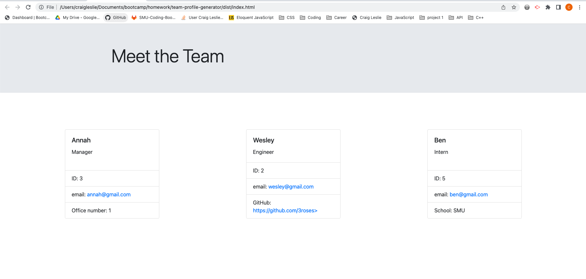

# Team Profile Generator

## Description

This program will generate an informational card for each employee on a specific team.  The user can generate a card for the manager, engineers, and interns.  Each card will contain unique information according to the specific role they play on the team.  For instance, the manager will be the only card that has an office number.  Similarly, engineers will be the only members with a github link and interns will be the only ones with a school listed.  Once all team member information is entered, an HTML file is created which can be opened in the web browser.  Each individual member has their own card with their own unique information.

## Table of Contents

1. [Installation](#installation)
2. [Usage Information](#usage)
3. [Contribution Guidelines](#contribution)
4. [Test Instructions](#test)
5. [Questions](#questions)
6. [License](#license)

## Installation 

The user must have inquirer installed as a dependency and run node index.js in the terminal.

## Usage Information 

This program's intended purpose is to provide a simple solution to creating clear and efficient employee information to all member's of a specific team.  The cards created contain vital information for each employee.  This information is displayed very clearly, with convenient links for email and github.  One of the best benefits of this program is that it provides a "one-stop-shop" for the essential contact information for everyone on the team.

## Contribution Guidelines 

* Report any bugs to the email below.
* If your code is complicated, use comments.
* Any major changes must be approved by the repo-manager.
* Be respectful.

## Test Instructions 

Open the integrated terminal from the package.json file and type the command "npm run test" to make sure the program is functioning properly on your personal machine.

## Walkthrough Video and Screenshot

* [Walkthrough video](https://drive.google.com/file/d/1OiSOL95bP9TjjMXQVLYsLhBJPspBjbx-/view)

## Licenses 

* The MIT License

## Questions 

* [GitHub](github.com/3roses) 
* [Email](mailto:cleslie25@gmail.com)
